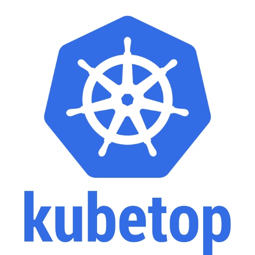
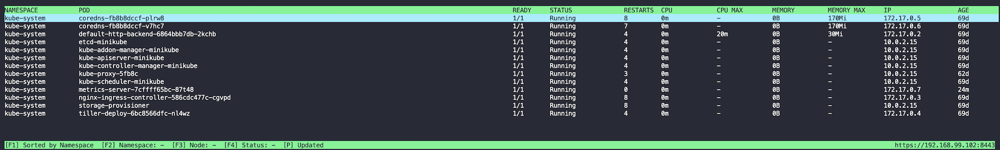
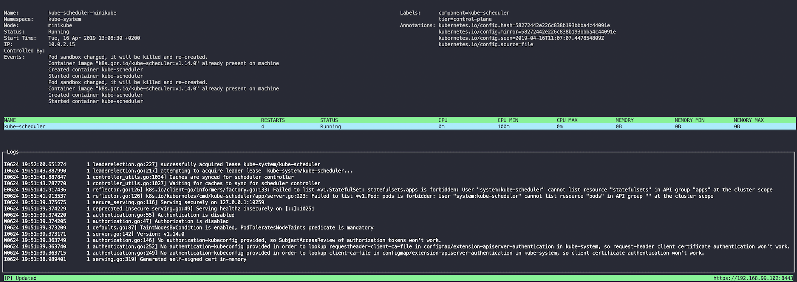

<div align="center">
  
  <br><br>

  Another terminal based activity monitor for Kubernetes.

  
  <br><br>
  
</div>

## Installation

See [https://github.com/ricoberger/kubetop/releases](https://github.com/ricoberger/kubetop/releases) for the latest release.

```sh
GOOS=$(go env GOOS)
GOARCH=$(go env GOARCH)
wget https://github.com/ricoberger/kubetop/releases/download/v1.0.1/kubetop-$GOOS-$GOARCH
sudo install -m 755 kubetop-$GOOS-$GOARCH /usr/local/bin/kubetop
```

## Usage

kubetop has two entrypoints. The first one is the `pods` view, which shows the ressources of all running pods in the cluster. The second one is the `nodes` view which shows the ressources of all running nodes in the cluster. By selecting a node in the nodes view you get an overview of all running pods on this node. When you select a pod you get some details about this pod, like events and logs.

```
Display Resource (CPU/Memory/Storage) usage of pods

Usage:
  kubetop [flags]
  kubetop [command]

Available Commands:
  help        Help about any command
  nodes       Display Resource (CPU/Memory/Storage) usage of nodes
  version     Print version information for kubetop

Flags:
  -h, --help                help for kubetop
      --kubeconfig string   Path to the kubeconfig file to use for CLI requests
  -n, --namespace string    If present, the namespace scope for this CLI request

Use "kubetop [command] --help" for more information about a command.
```

The following keys can be used for the navigation in kubetop.

| Key | Nodes | Pods | Pod Details | Events | Event Details |
| --- | ----- | ---- | ----------- | ------ | ------------- |
| `q`, `<C-c>` | Quit | Quit | Quit | Quit | Quit |
| `k`, `<Up>`, `<MouseWheelUp>` | Scroll up through nodes | Scroll up through pods | Scroll up through logs | Scroll up though events | - |
| `j`, `<Down>`, `<MouseWheelDown>` | Scroll down through nodes | Scroll down through pods | Scroll down through logs | Scroll down though events | - |
| `<Home>`, `gg` | Scroll to the first node  | Scroll to the first pod | Scroll to the first log line | Scroll to the first event | - |
| `G`, `<End>` | Scroll to the last node | Scroll to the last pod | Scroll to the last log line | Scroll to the last event | - |
| `<C-d>` | Scroll half page down | Scroll half page down | Scroll half page down | Scroll half page down | - |
| `<C-u>` | Scroll half page up | Scroll half page up | Scroll half page up | Scroll half page up | - |
| `<C-f>` | Scroll page down | Scroll page down | Scroll page down | Scroll page down | - |
| `<C-b>` | Scroll page up | Scroll page up | Scroll page up | Scroll page up | - |
| `<Tab>` | - | - | Select next container | - | - |
| `p` | Pause updating data | Pause updating data | Pause updating data | Pause updating data | Pause updating data |
| `<Enter>` | Select node / Apply selected sortorder | Select pod / Apply selected sortorder/filter | - | Select event / Apply selected sortorder/filter | - |
| `<Escape>` | Close sortorder modal | Close sortorder/filter modal | Go back to the pods view | Close sortorder/filter modal | Go back to the events view |
|  `<F1>` | Show available sortorder | Show available sortorder | - | Show available sortorder | - |
|  `<F2>` | - | Show namespace filter | - | Show namespace filter | - |
|  `<F3>` | - | Show node filter | - | Show node filter | - |
|  `<F4>` | - | Show status filter | - | Show event type filter | - |

## Dependencies

- [gotop](https://github.com/cjbassi/gotop): A terminal based graphical activity monitor inspired by gtop and vtop
- [cobra](https://github.com/spf13/cobra): A Commander for modern Go CLI interactions
- [termui](https://github.com/gizak/termui): A cross-platform and fully-customizable terminal dashboard and widget library
- [kubernetes](https://github.com/kubernetes/kubernetes): Production-Grade Container Scheduling and Management
